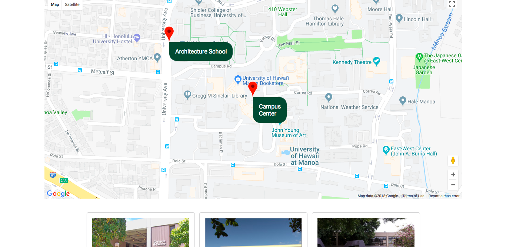

<div class="ui small rounded images">
  
  
</div>

For my ICS 314, Software Engineering, my group and I were given the task to create a website that helps students or UHM staff. My group and I created a website to help students find the buildings that their classes would be held. We did this by utilizing the Google Maps api and other Semantic UI features.

For this project, I was tasked with helping create the search bar and add card page. We did this by using the Semantic UI feature that is both a dropdown menu and a search bar. I was solely responsible for adding all the buildings on campus to the database that stored the address, image, longitude, latitude. 

Here is some code that illustrates how we built the add card page:

```js
  return (
        <Grid container centered>
          <Grid.Column>
            <Header as="h2" textAlign="center">Add Classes</Header>
              <Segment>
                <Dropdown
                    button
                    labeled
                    fluid
                    options={buildingTestArr}
                    search
                    selection
                    placeholder='Select Building'
                    onChange={this.submitBuilding}
                />
                <Button onClick={this.onClick}>Submit</Button>
              </Segment>
              <Segment>
                <Card.Group>
                  {this.props.buildings.map((building, index) =>
                    <UserBuildings key={index}
                                   building={building}
                                   notes={this.props.notes.filter(note => (note.buildingId === building._id))}
                    />  )}
                </Card.Group>
              </Segment>
          </Grid.Column>
        </Grid>
    );
```

You can learn more at the [Aumakua Website](aumakua.meteorapp.com).


