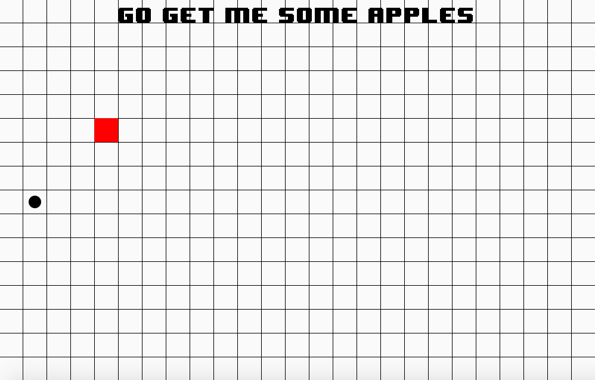

For our ICS 111 class my team and I decided to create a game where you control a dot on a 2D array and you collect red dots.

Vacay is implemented using Eclipse, a Java application platform. Within two weeks, we created a game that implements sa 2D array board where a dot can travel on and collect the red dot.

I was responsible for where the red dot will appear and also helped with the 2D array board and how the black dot travels on the board. 
 
Source: <a href="https://www.youtube.com/watch?v=sG2sjBAMj9s"> Youtube video </a>
